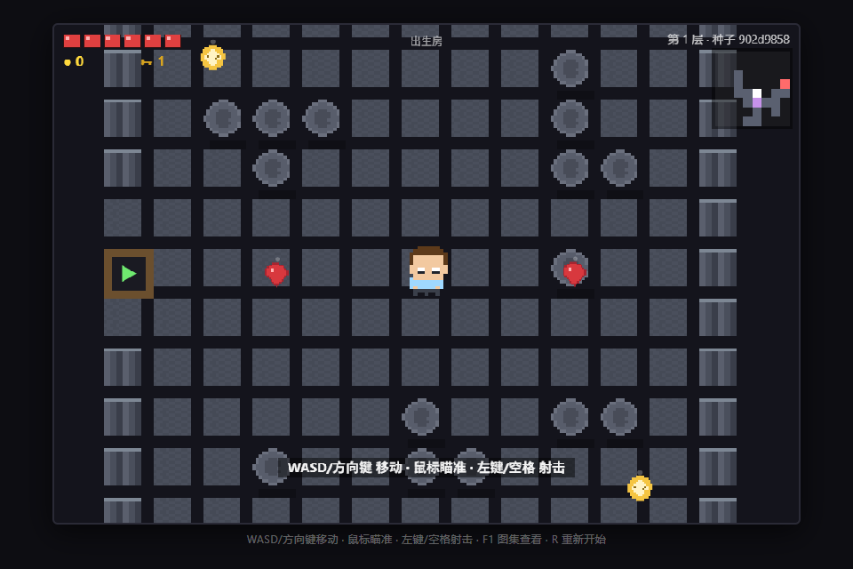

# 🎮 眼泪地牢（Tear Dungeon）

一款受《以撒的结合》（The Binding of Isaac）启发、使用 **Electron + HTML5 Canvas** 开发的
**肉鸽（Roguelike）射击游戏**，项目源码位于 [`isaac-roguelike/`](isaac-roguelike/)。



## ✨ 特性

- 🏠 **随机房间地图**：种子驱动的连通房间网格，含出生房 / 普通房 / 道具房 / Boss 房，门切换 + 小地图
- 🎯 **双摇杆射击**：WASD 移动 + 鼠标瞄准，抛物线泪滴
- 👾 **多种敌人与 Boss**：史莱姆、幽灵、飞虫、射手，以及会弹幕、冲刺、召唤的 Boss
- 💊 **肉鸽循环**：房间清场锁门、红心 / 金币 / 钥匙拾取、道具房随机增益（8 种道具）、
  3 层通关胜利 + 无尽模式、死亡重开换种子
- 🎨 **免费素材**：敌人 / 宝箱 / 药水使用 Tiny16 CC0 像素素材，主角与道具为程序化像素
- 🧪 **可测试**：核心逻辑与渲染分离，40 项无头断言 + Electron 冒烟测试

## 🚀 快速开始

```bash
cd isaac-roguelike
npm install        # 首次安装（下载 Electron）
npm start          # 启动游戏
npm test           # 运行核心逻辑无头测试（40 项断言）
```

需要 Node.js ≥ 18 与 npm。

## 🎮 操作

| 按键 | 功能 |
| --- | --- |
| `WASD` / 方向键 | 移动 |
| 鼠标 + 左键 / `空格` | 瞄准 / 射击 |
| `R` | 重新开始（新种子） |
| `F1` | Tiny16 素材帧查看器 |
| `Enter`（胜利后） | 继续无尽模式 |

## 🗺️ 玩法流程

1. 从**出生房**出发（有红心与金币补给）
2. 进入普通房，**清空敌人**解锁大门
3. 用**钥匙**打开道具房，拾取随机增益道具
4. 在小地图上找到 **Boss 房**（红色方块），击败 Boss
5. 连闯 **3 层**通关胜利，或按 `Enter` 进入无尽模式

## 📁 项目结构

```
.
├── isaac-roguelike/          # 游戏完整源码
│   ├── main.js               # Electron 主进程
│   ├── game/
│   │   ├── index.html        # 游戏页面
│   │   └── js/               # 11 个游戏模块（逻辑与渲染分离）
│   ├── assets/               # Tiny16 CC0 素材与归属说明
│   ├── scripts/              # 开发工具（素材下载 / 帧分析 / 冒烟测试）
│   ├── headless-test.js      # 无头逻辑测试
│   └── docs/screenshot.png
└── README.md                 # 本文件
```

详细说明见 [`isaac-roguelike/README.md`](isaac-roguelike/README.md)。

## 🧠 技术要点

- **逻辑 / 渲染分离**：`game.js`、`entities.js`、`mapgen.js` 等核心模块不依赖 DOM，
  可直接在 Node 中测试；渲染由 `renderer.js` 负责
- **种子系统**：每局随机种子，同种子生成相同地图（可复现）
- **UMD 模块化**：浏览器端通过 `shim.js` 提供 `require`，Node 端原生支持

## 📜 素材授权

- 像素素材：**Tiny 16: Basic** by Lanea Zimmerman（CC0 1.0 公有领域）
  来源 <https://opengameart.org/content/tiny-16-basic>
- 帧映射与归属明细见 [`isaac-roguelike/assets/README.md`](isaac-roguelike/assets/README.md)

## 📌 已知限制（可迭代方向）

- 无音效（可用 WebAudio 合成）
- 无商店 / 更多道具类型 / 存档系统
- 道具房仅需 1 把钥匙（无钥匙消耗扩展系统）
